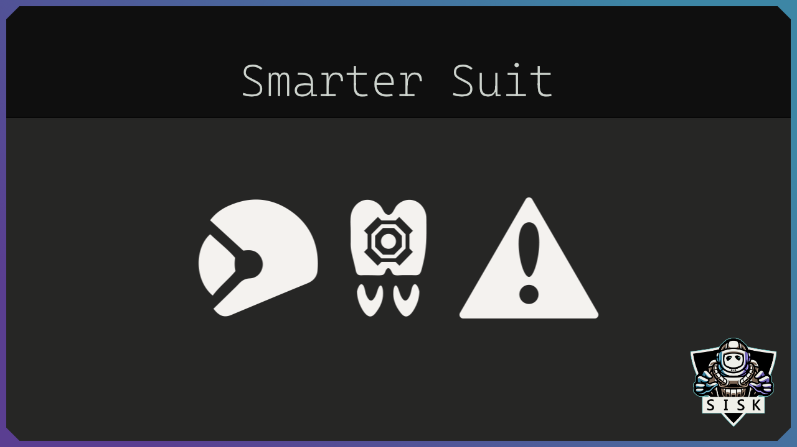

# Smarter Suit

- [Smarter Suit](#smarter-suit)
  - [🛠︰Info](#info)
  - [🛠︰Installation](#installation)
  - [🛠︰Options](#options)
  - [🛠︰Commands](#commands)
  - [🛠︰Mod Support](#mod-support)
  - [🛠︰Support](#support)
  - [🛠︰Credits](#credits)

## 🛠︰Info

A small suit software update that prevents death due to malfunction of the suit.

The new suit update will now check some parameters when leaving a cockpit or after a respawn to eliminate potential sources of danger.
In addition, the speed is adjusted relative to the ship.

**helmet** (*will check every 30 ticks*.) 
* opened when enviroment with oxygen detected.
* closed when enviroment without oxygen detected.

**jetpack**
* enabled when no gravity detected or gravity detected and no ground in range.
* disabled when gravity detected and ground is in range.

**dampeners** (*only after respawn in the medical room*)
* enabled when ship is not moving or when no ground in range and in planetary gravity well.
* disabled when ship is moving.

**broadcast** (*only after respawn in the medical room*)
* enabled when the suit was broadcasting before the respawn.
* disabled when the suit was not broadcasting before the respawn.

## 🛠︰Installation

The easiest way is to download it from [SteamWorkshop](https://steamcommunity.com/sharedfiles/filedetails/?id=1516827689).

You can also download the latest zip from [releases](https://github.com/SiskSjet/SmarterSuit/releases) and extract it to your '%appdata%\SpaceEngineers\Mods' folder

## 🛠︰Options

* **AlwaysAutoHelmet/AAH** (*boolean*) - Will check everytime if helmet is needed. I don't recomend this setting for multiplayer with airthigness enabled, because of an bug with cockpits.
* **DelayAfterManualHelmet/DAMH** (*integer*) - This will delay the auto helmet check for x ticks after the player toggled his helmet manualy.
* **AdditionalFuelWarning/AFW** (*boolean*) - Will play a additional fuel warning at given threshold.
* **FuelThreshold/FT** (*float*) - The fuel threshold used for additional fuel warnings. *Default: 0.25* Range is 0-1.
* **DisableAutoDampener/DAD** (*byte*) - Option to disable automatic dampener changes. *Default: 0 (Disabled)* 0 = Disabled | 1 = only mod changes disabled | 2 All dampener changes disabled.
* **HaltedSpeedTolerance/HST** (*float*) - Option to adjust the speed tolerance that declares a ship specifies as not moving. *Default: 0.01*.
* **AlignToGravity/ATG** (*boolean*) - Option to align the player to the gravity vector when flying. *Default: false*.
* **AlignToGravityDelay/ATGD** (*float*) - Delay, after which the suit tries to align to gravity. . *Default: 312*.
* **RememberBroadcast/RB** (*boolean*) - Option to remember the broadcast state of the suit. *Default: true*.

## 🛠︰Commands

`Usage: /ss [command] [arguments]`

**Available commands**:
* **Enable** [*option*] *- Enables an option*
* **Disable** [*option*] *- Disables an option.*
* **Set** [*option*] [*value*] *- Set an option to value.*
* **List** *- Lists all options.*
* **Help** *- Shows a help window with all commands.*

## 🛠︰Mod Support

[Remove all automatic jetpack activation](https://steamcommunity.com/sharedfiles/filedetails/?id=782845808) This mod will then not change the jetpack status.

## 🛠︰Support

It would be nice if you could consider supporting me 

  

or join my [Discord](https://discord.gg/2s22YCqSFg) if you have suggestions, wishes, or just want to know what else I'm working on. My Discord is new, so there is not much going on yet.
You can also check out my other mods in my [Workshop](https://steamcommunity.com/id/sisksjet/myworkshopfiles/?appid=244850).

## 🛠︰Credits

Icons used in this mod:
* All icons were recreated as a vector icon.
* helmet icon from [SpaceEngineers](https://www.spaceengineersgame.com) by [Keen Software House](https://www.keenswh.com)
* jetpack icon from [SpaceEngineers](https://www.spaceengineersgame.com) by [Keen Software House](https://www.keenswh.com)
* dampener icon from [SpaceEngineers](https://www.spaceengineersgame.com) by [Keen Software House](https://www.keenswh.com)
  
